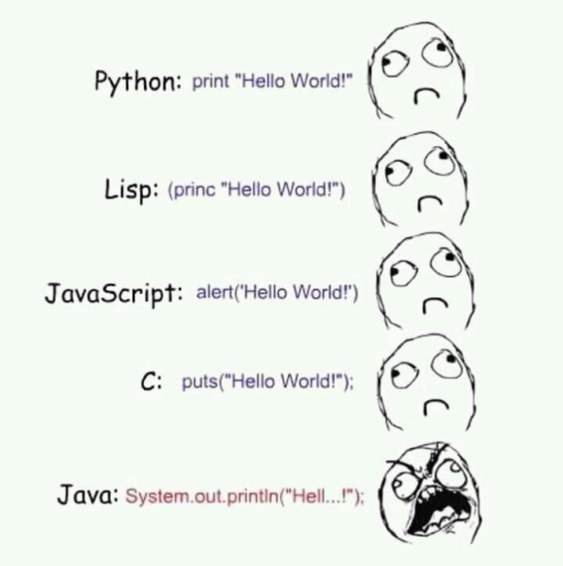

# Test Repository
Stworzone na potrzeby przedmiotu Narzędzia informatyczne.

##Cel
Przećwiczenie, np. syntaxu Markdown :smiley:

###Przykłady formatowania

**Kod w Javie**

```Java
public class Constructor{
    private String name;

    public Constructor(String name) {
            this.name = name;
    }
}
```

**Cytat**

Alan Kays definition of OOP:

>OOP to me means only messaging, local retention and protection
> and hiding of state-process, and extreme late-binding of all things.


**Obrazek**




**Task list**
- [x] Readme
